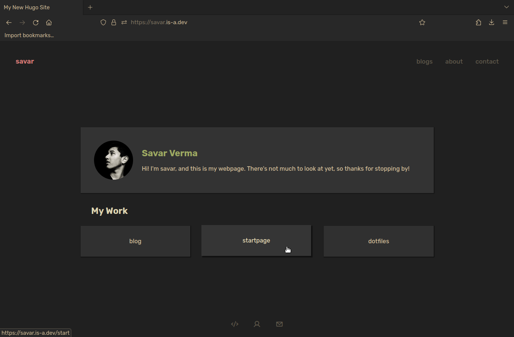
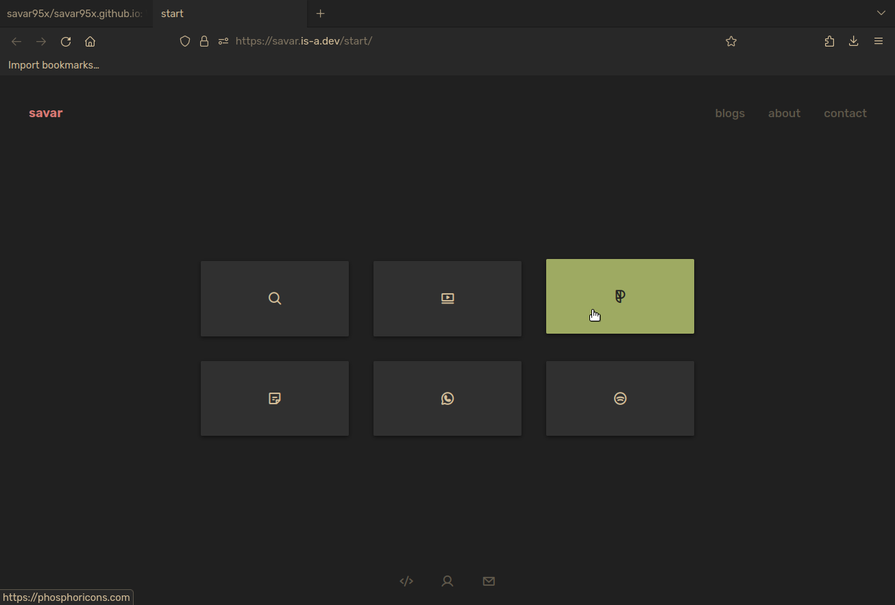

# My Webpages
This is a collection of my webpages.  
There are a total of 6 startpages that I've made (for personal use). Feel free to check them out.

## Homepage

## My Startpage(s)

## Useful links
- [pagespeed insights](https://pagespeed.web.dev)

## Todo
- [ ] Complete 'programming my workout split' blog and add date(s) of when written
- [ ] add workout split, once finalized, as a conclusion to the first blog
- [ ] eventually add tags or categories for better navigation; talking of which eventually add pagination as well
- [ ] fix css and font loadingg
- [x] fix old startpage
- [x] make site just working
- [x] Improve the js of the startpage
- [x] learn hugo
- [x] get an is-a.dev domain
- [x] unify style.css and basic html
- [x] make header more mobile friendly
- [x] <s>startpage 6; make a new startpage (eventually) with the same colorscheme but a style like Bento. The current one looks too packed unnecessarily.</s>
- [x] Make a new bento inspired homepage, looking at the current layout again and again will make me throw up

### Ideas
- [ ] A quote from movies page that returns json on curl
- [ ] Great quote from men page that returns json on curl
- [ ] A movies and series library page with summary review
- [ ] A movies and series close to my heart page with detailed review review
- [ ] Books reviews
- [ ] Chapter reviews like jbp, for ex study a chap throughout a week and put out a detailed analysis. To teach is to learn twice.
- [ ] Courses (like from coursera), Lectures (like JBP), and videos (like NH) notes
- [ ] Just random rants or discussions about topics
