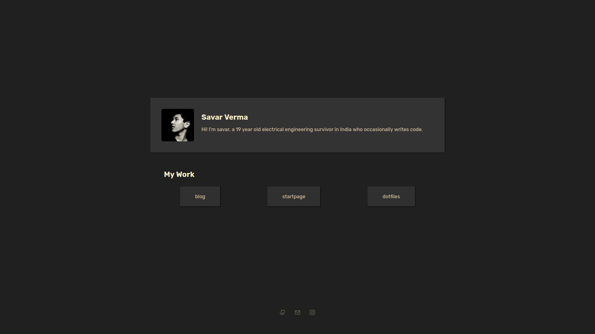
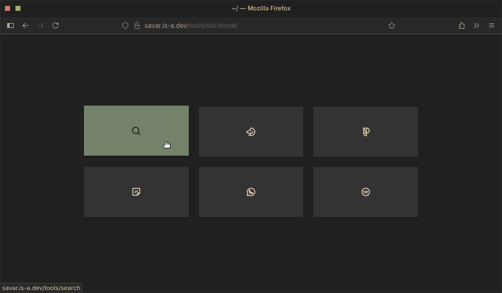

Source for my website.  
Still in works, but below are some previews.  

## [Homepage](https://savar.is-a.dev/tools/home)

## [Old Homepage](https://savar.is-a.dev/tools/old-home)

### Todo
- [ ] more padding between different elements
- [ ] footer hr (better center alignment way)
- [ ] next and previous articles once a lot of articles are there
- [ ] image previews in list pages, instead of text lines
- [ ] better andersnoren inspired blog single page

<!--
## Useful links
- [pagespeed insights](https://pagespeed.web.dev)

- **focus on content now, aesthetics can be learnt later on as well, right now it just needs to be presentable**
## Todo
- [ ] maybe add a sidemenu for phones
- [ ] fix footer icon size difference
- [ ] fix first time css and font loading
- [x] format blog list on mobiles better
- [x] complete 'programming my workout split' blog and add date(s) of when written
- [x] add workout split, once finalized, as a conclusion to the first blog
- [x] fix old startpage
- [x] make site just working
- [x] Improve the js of the startpage
- [x] learn hugo
- [x] get an is-a.dev domain
- [x] unify style.css and basic html
- [x] make header more mobile friendly
- [x] <s>startpage 6; make a new startpage (eventually) with the same colorscheme but a style like Bento. The current one looks too packed unnecessarily.</s>
- [x] Make a new bento inspired homepage, looking at the current layout again and again will make me throw up
- [ ] eventually add tags or categories for better navigation; talking of which eventually add pagination as well

### Ideas
- [ ] A quote from movies page that returns json on curl
- [ ] Great quotes page that returns json on curling from cli
- [ ] A movies list close to my heart page with brief review, without spoilers
- [ ] Books reviews
- [ ] Chapter reviews like jbp, for ex study a chap throughout a week and put out a detailed analysis. To teach is to learn twice.
- [ ] Courses (like from coursera), Lectures (like JBP), and videos (like NH) notes
- [ ] Just random rants or discussions about topics
-->
