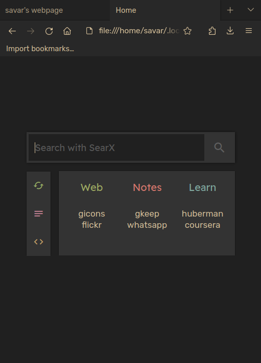

# My Webpages
This is a collection of my webpages.  
There are a total of 6 startpages that I've made (for personal use). Feel free to check them out.

## Homepage

## My Startpage(s)

## Todo
- [ ] <s>homepage needs addition; maybe add some colors, some links on the top (axarva.me, nav.al); a section that shows the recent posts (blogs/vids/projects); optimize better for other devices; add an about page</s>
- [ ] Make a new bento inspired homepage, looking at the current layout again and again will make me throw up
- [ ] blogs; natural hypertrophy notes for public use.
- [ ] startpage 6; make a new startpage (eventually) with the same colorscheme but a style like Bento. The current one looks too packed unnecessarily.
- [ ] get an is-a.dev domain
- [ ] add header and footer in startpage as well
- [ ] unify style.css and basic html
- [ ] make header more mobile friendly, add threeline
- [ ] learn hugo

### Ideas
- [ ] A quote from movies page that returns json on curl
- [ ] Great quote from men page that returns json on curl
- [ ] A movies and series library page with summary review
- [ ] A movies and series close to my heart page with detailed review review
- [ ] Start a youtube channel
- [ ] Books reviews
- [ ] Chapter reviews like jbp, for ex study a chap throughout a week and put out a detailed analysis. To teach is to learn again.
- [ ] Courses (like from coursera), Lectures (like JBP), and videos (like NH) notes
- [ ] Just random rants or discussions about topics
